**Back-Propagation Algorithm Neural Networks** 

- **Matan Yarin Shimon: 314669342** 
- **Or Yitshak: 208936039** 
- **Netanel Levine: 312512619** 
- **Yahalom Chasid: 208515577**  

**Dataset:** 

Our dataset holds 1000 2D points ( , ) and each point has a value that will mark it as  .

- The value of  is of the form   where  is an integer,  −10000 ≤ ≤ 10000. 100
- The value of  is of the form   where  is an integer,  −10000 ≤ ≤ 10000. 100
- The value of  is −1  1. 

As a reminder in part A, the value of  was determined by: 

1, > 1

- (( , )) = {

−1, ℎ

As a reminder in part B, the value of  was determined by: 

1, 4 ≤ 2 + 2 ≤ 9

- (( , )) = {

−1, ℎ

**Part C:** 

In this part, we will try to improve our scores from parts A and B by using the Back-Propagation Algorithm with the MLP Classifier. 

In part A our score was:  . %

Explanation of the right scatter: 

- The **red** area is all the points that their  = −1 because  <= 1. 
- The **green** area is all the points that their  = 1 because  > 1. 
- The **blue** dots mark the points that our model predicted as  = 1. 
- The **purple** dots mark the points that our model predicted as  = −1. 
1. Every time our model marked a point as **blue** and this point lies in the range of the **green** area, our model predicted the correct answer. 
1. Every time our model marked a point as **purple** and this point lies in the range of the **red** area, our model predicted the correct answer. 
1. Every time our model marked a point as **blue** and this point lies in the range of the **red** area, our model predicted the wrong answer. 
1. Every time our model marked a point as purple and this point lies in the range of the **green** area, our model predicted the wrong answer. 

As we can see, near the line where  = 0 the model had a few mistakes. 

Because our score is almost perfect and Back-Propagation is much more accurate than Adaline we won’t perform the Back-Propagation Algorithm on the part A function. 

In part B we scored  . %** and we thought that this is too good to be true. 

We did some digging and we found out that the range of the points that can get a value of 1 is small if we compare it to the range of all the points. This means a high probability of a point 

( 100%) landing in the −1 range which can cause our model to overfit and  

always predict  −1. 

As we can see in the confusion matrix below, we got amazing result but the model predict most of the time −1: 

So we decided to balance the data by giving our model approximately half instances from  

each type. After doing so our model accuracy was quite bad  . % with Adaline Algorithm. 

Finally, now we will try to improve our model accuracy by using the Back-Propagation Algorithm using the MLP. 

Let’s recall our problem: 

1, 4 ≤

- (( , )) = {

−1, ℎ

2 + 2 ≤ 9

We solved this problem using the MLP Classifier from Sklearn.  

The MLPClassifier uses Feed-Forward Networks and Back-propagation, with a given data and desired output, the MLPClassifier train the model and changes the weight and bias accordingly. 

We chose to do it with 2 hidden layers: 

1. The first hidden layer will have 8 neurons. 
1. The second hidden layer will have 2 neurons. 

Below we can see a diagram for this network:

**Hidden First Layer  **

**Input Layer  Hidden Second Layer 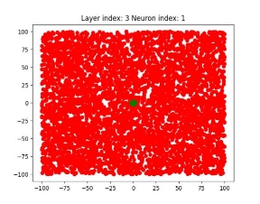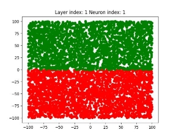**

**1  5 **

8 inputs for

` `each neuron

**1  1 **

**2  6 **

**3  7  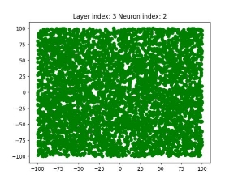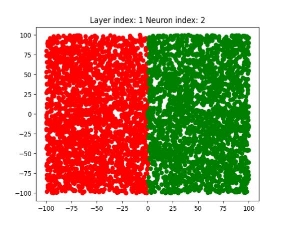**

8 inputs for

` `each neuron

**2  2** 

**4  8 **

**Output Layer   Output Layer After Zoom  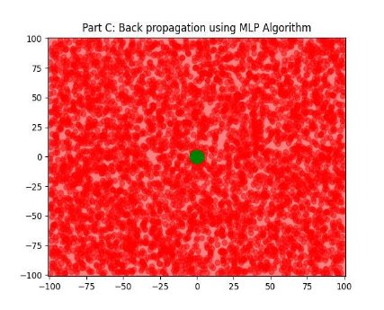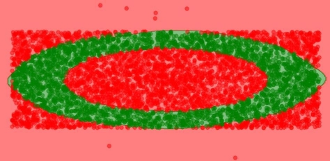**

Because our formula is: 

- (( , )) = { 1, 4 ≤ 2 + 2 ≤ 9 −1, ℎ

It makes sense that all the green area will look like the space with: 

All the circles such that: 2 ≤ ≤ 3,  and with the center of (0,0), and with  , such that:  {4 ≤ 2 + 2 ≤ 9}.* 

To conclude the Back-Propagation Algorithm using the MLP result of part B with  the balanced dataset was  . %**.**

Which is almost twice as better as the Adaline score which was  . %**.** We can see from the Confusion Matrix that the model doesn’t overfit: 

**Back-Propagation  Adaline** 

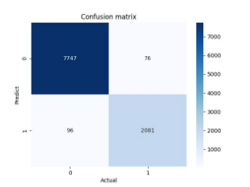

**Part D:** 

In this part, we will use our trained neurons from the next to last level of part C as our input. The last neuron will do the prediction according to the Adaline algorithm and not the Back- Propagation Algorithm that we used in part C, and we will train only the Adaline neuron. 

Our problem is the same as before:  

1, 4 ≤ 2 + 2 ≤ 9

- (( , )) = {

−1, ℎ

After doing so, combining the MLP Classifier with the Adaline Algorithm, our model  score was  . %.

Which is almost the same as the result of the Back-Propagation Algorithm  . %**.** Below we can see a diagram for this network:

**Hidden First Layer  **

**Input Layer  Hidden Second Layer **

**1  5 **

8 inputs for

` `each neuron

**1  1 **

**2  6 **

**3  7  **

8 inputs for

` `each neuron

**2  2** 

**4  8 **

**Output Layer   Output Layer After Zoom  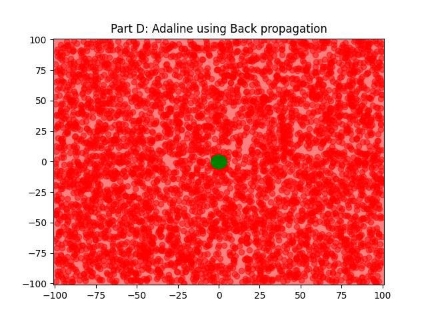**

As we saw in the diagram the scatters of the Adaline using the MLP and the Back-Propagation using the MLP are almost identical, which is why both of the scores are almost the same. From the Confusion Matrix, we can conclude that both models’ prediction was quite similar. 

**Adaline with MLP** 

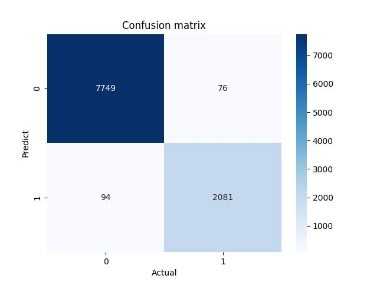

**Back-Propagation with MLP** 

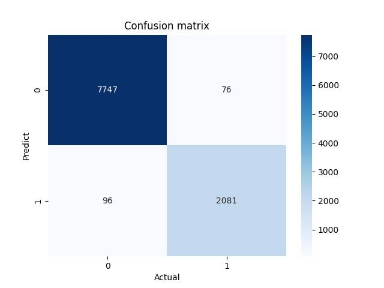

We can see that the only difference between those models is that Adaline with MLP predicted  2  points as −1 while Back-Propagation with MLP predicted apparently those points as 1. 

To conclude, our first Adaline (from part B) score was: **55.879%**, the Back-Propagation with MLP score was **98.28%,** and the Adaline with MLP score was **98.3%**. 

So we saw that MLP was able to improve our model and by using MLP in two different Algorithms we got almost the same scores. 

**Code:** 

Functions to create random points the first is balanced the second is not: 

Main: 

partC function: 

diagram: 

show\_area: 

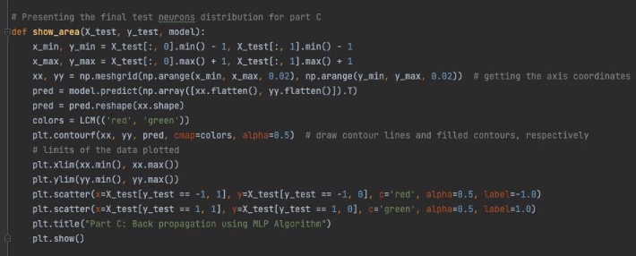

get\_cm (confusion matrix): 

partD function: 

Adaline\_with\_MLP: 

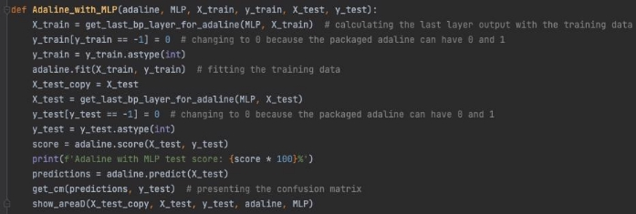

get\_last\_bp\_layer\_for\_adaline: 

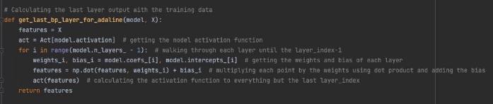

show\_areaD: 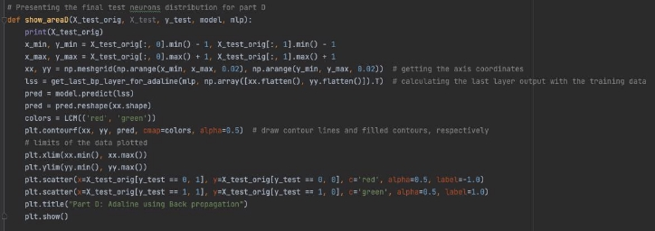
